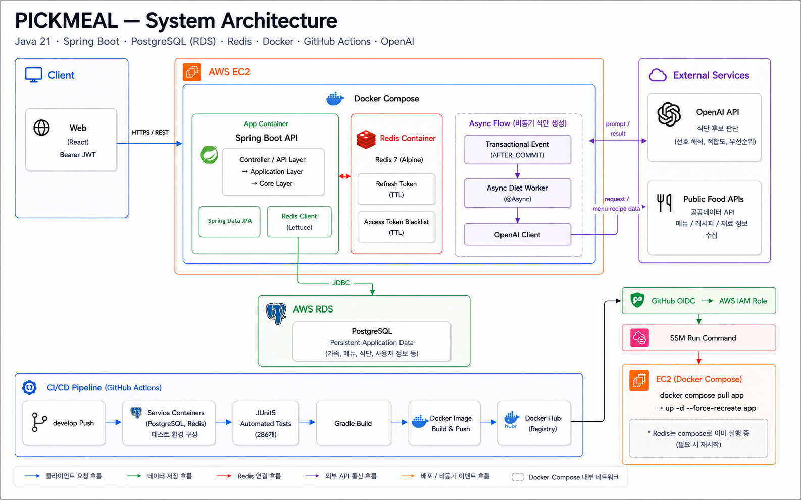
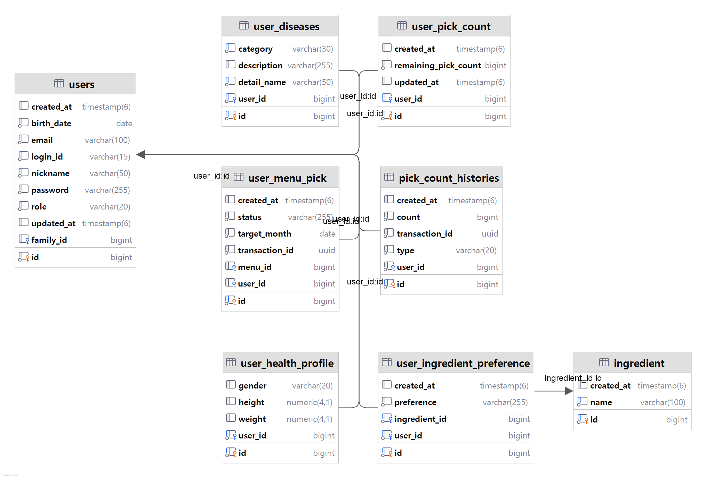
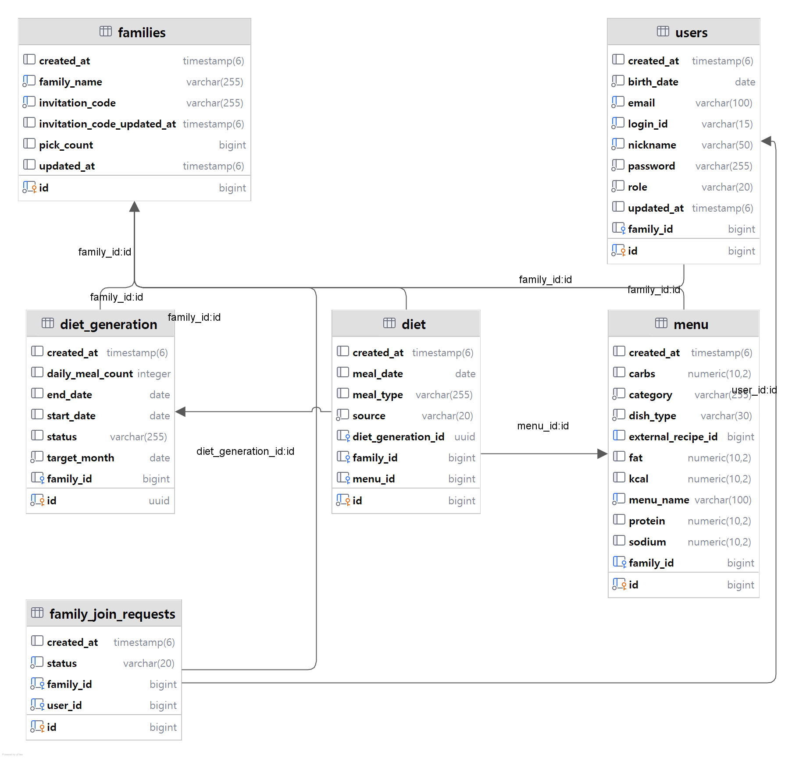
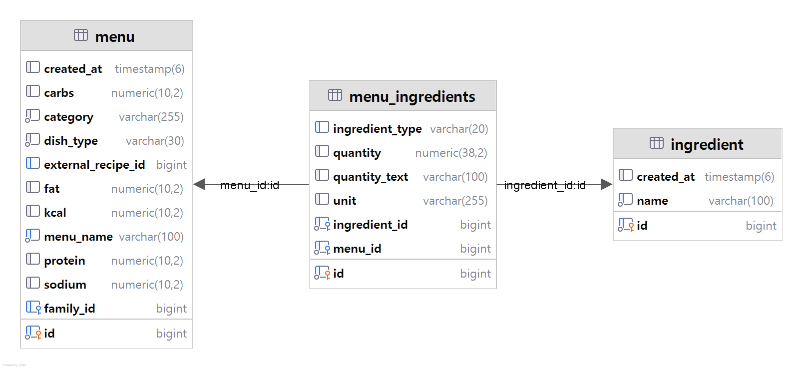
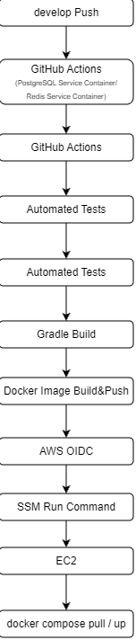

# PickMeal

> 가족 구성원의 선호와 건강 정보를 반영하여 맞춤형 식단을 생성하고 관리하는 서비스

PickMeal은 가족 구성원이 많아질수록 각자의 선호 메뉴, 기피 재료, 알레르기와 질환 정보를 함께 고려해 식단을 결정하기 어렵다는 문제에서 시작했습니다.

사용자가 원하는 메뉴를 직접 선택할 수 있으며, 서버는 가족 구성원의 선호·기피·건강 정보와 사용 가능한 메뉴 후보를 취합해 OpenAI API에 전달합니다.

초기에는 LLM이 날짜, 끼니, 메뉴 개수와 같은 식단 구성 규칙까지 결정하도록 구현했지만, 메뉴 누락이나 중복 등 반드시 지켜야 하는 규칙을 항상 보장하기 어렵다는 한계가 있었습니다.

현재는 **LLM이 가족에게 적합한 메뉴의 우선순위와 배치를 판단하고, 날짜·끼니 구성, 메뉴 개수, 중복 제한, 알레르기 검증과 같은 결정적인 비즈니스 규칙은 서버가 관리**하도록 역할을 분리했습니다.

또한 외부 AI 호출이 포함된 식단 생성 작업은 HTTP 요청과 분리하여 비동기로 처리하고, `DietGeneration`의 상태를 통해 생성 진행 과정과 실패 여부를 관리합니다.

### 주요 기능

- JWT 기반 인증·인가 및 Redis 기반 Token 상태 관리
- 가족 생성·합류 요청·승인 및 가족 리더 권한 관리
- 사용자 건강 정보, 질환, 선호·기피 재료 관리
- 사용자별 메뉴 선택 및 선택권 관리
- OpenAI API를 활용한 맞춤형 식단 생성
- 비동기 식단 생성 및 `PENDING / PROCESSING / COMPLETED / FAILED` 상태 관리
- 생성된 식단 조회 및 메뉴 교체
- 공공데이터 API 기반 메뉴·레시피·재료 데이터 수집 및 정규화

## 2. Tech Stack

### Backend

- **Java 21**
- **Spring Boot**
- **Spring Web MVC**
- **Spring Data JPA**
- **Spring Security**
- **Spring Validation**
- **Spring Async**
- **Spring Transaction**
- **Gradle**

### Database & Cache

- **PostgreSQL**
  - 사용자, 가족, 메뉴, 식단 등 영속 데이터 관리
  - 운영 환경에서는 AWS RDS 사용
- **Redis**
  - Refresh Token 저장
  - Access Token Blacklist 관리
  - TTL 기반 인증 상태 만료
  - 운영 환경에서는 EC2의 Docker Compose로 실행

### External API

- **OpenAI API**
  - 가족 구성원의 선호·건강 정보를 반영한 메뉴 적합성 판단 및 식단 배치
- **공공 레시피 API**
  - 메뉴·레시피 데이터 수집
- **식품안전나라 Open API**
  - 메뉴 및 재료 데이터 수집

### Test

- **JUnit 5**
- **Mockito**
- **JaCoCo**

### Infrastructure & CI/CD

- **Docker / Docker Compose**
- **Docker Hub**
- **AWS EC2**
- **AWS RDS**
- **AWS IAM**
- **AWS Systems Manager (SSM)**
- **GitHub Actions**
- **GitHub OIDC**

GitHub Actions에서 자동화 테스트와 Gradle Build를 수행한 뒤,
테스트가 성공한 경우에만 Docker Image를 생성하여 Docker Hub에 Push합니다.

배포 단계에서는 GitHub OIDC를 통해 AWS의 임시 권한을 획득하고,
SSM Run Command를 이용해 EC2의 Docker Compose 환경에 새로운 애플리케이션 이미지를 배포합니다.

## 3. System Architecture



PickMeal은 **Spring Boot API를 중심으로 PostgreSQL, Redis, OpenAI API 및 공공데이터 API를 연동**한 구조입니다.

운영 환경에서는 Spring Boot 애플리케이션과 Redis를 **AWS EC2의 Docker Compose 환경**에서 실행하고, 영속 데이터는 **AWS RDS PostgreSQL**에 저장합니다.

### Application

애플리케이션 내부는 다음과 같이 계층별 책임을 분리했습니다.

- **API**
  - HTTP 요청·응답 처리
  - Request Validation
  - 인증 사용자 처리
  - 예외 Handler

- **Application**
  - Service를 통한 유스케이스 실행
  - DTO 구성
  - 트랜잭션 경계 관리
  - 여러 도메인 작업 조합

- **Core**
  - 핵심 Domain Model
  - Business Rule
  - Repository Port
  - AI 식단 생성에 필요한 핵심 인터페이스 및 규칙

- **Infrastructure**
  - Spring Data JPA 기반 Repository 구현
  - Redis 연동
  - OpenAI API Client
  - 공공 레시피·식품안전나라 API Client

Core에서는 데이터 접근에 필요한 Repository Interface를 정의하고,
Infrastructure에서 실제 JPA 기반 구현을 제공하도록 구성했습니다.

이를 통해 핵심 비즈니스 로직이 PostgreSQL, Redis, OpenAI와 같은
구체적인 외부 기술에 직접 의존하지 않도록 했습니다.

### Data Storage

- **PostgreSQL (AWS RDS)**
  - 사용자·가족·메뉴·재료·식단 등 영속 데이터 저장

- **Redis (EC2 / Docker Compose)**
  - Refresh Token 저장
  - Access Token Blacklist 관리
  - TTL 기반 인증 상태 만료

### External Services

- **OpenAI API**
  - 서버에서 선별한 메뉴 후보를 기반으로 가족 구성원의 선호와 건강 정보를 고려한 메뉴 적합성 및 식단 배치 판단

- **Public Food APIs**
  - 메뉴·레시피·재료 원본 데이터 수집

### Async Diet Generation

외부 AI 호출이 포함되는 식단 생성은 일반적인 HTTP 요청과 분리해 비동기로 처리합니다.

`DietGeneration` 저장 트랜잭션이 완료된 이후
`@TransactionalEventListener(AFTER_COMMIT)`가 이벤트를 수신하고,
`@Async` 작업에서 OpenAI API 호출과 식단 생성을 수행합니다.

이를 통해 아직 Commit되지 않은 데이터를 비동기 작업이 조회하는 문제를 방지하고,
외부 API 호출이 요청 저장 트랜잭션을 장시간 점유하지 않도록 구성했습니다.

> CI/CD 배포 흐름은 아래 `CI/CD` 섹션에서 별도로 설명합니다.

## 4. Project Structure

현재 애플리케이션은 `api`, `application`, `core`, `infrastructure`를 중심으로 계층을 분리하고,
공통 응답과 예외 처리는 `common`에서 관리하도록 구성했습니다.

```text
src/main/java/kongju.pickmeal
├── api
│   ├── auth
│   ├── diet
│   ├── exception
│   ├── family
│   ├── menu
│   ├── security
│   └── user
│
├── application
│   ├── auth
│   ├── diet
│   ├── family
│   ├── menu
│   └── user
│
├── common
│   ├── ApiResponse
│   └── exception
│
├── core
│   ├── ai
│   ├── auth
│   ├── common
│   ├── diet
│   ├── family
│   ├── menu
│   ├── service
│   └── user
│
├── infrastructure
│   ├── config
│   ├── external
│   │   ├── ai
│   │   └── recipe
│   ├── repository
│   └── service
│
└── PickMealApplication
```

### API

외부 HTTP 요청과 응답을 처리하는 계층입니다.

도메인별 API와 인증·보안 관련 처리를 분리했으며,
요청 검증과 예외 Handler 역시 API 계층에서 관리합니다.

```text
api
├── auth
├── diet
├── exception
├── family
├── menu
├── security
└── user
```

### Application

하나의 유스케이스를 실행하는 Service와
계층 간 데이터 전달에 사용하는 DTO를 관리합니다.

Controller에서 전달받은 요청을 바탕으로 필요한 Core의 비즈니스 규칙과
Repository 작업을 조합하고, Transaction이 필요한 작업의 경계를 관리합니다.

```text
application
├── auth
├── diet
├── family
├── menu
└── user
```

### Core

프로젝트의 핵심 Domain과 Business Rule을 관리합니다.

식단, 가족, 메뉴, 사용자, 인증과 같은 도메인 로직과
외부 구현체가 따라야 하는 Repository 및 AI 관련 계약을 Core에 두어,
핵심 로직이 구체적인 외부 기술 구현에 직접 의존하지 않도록 구성했습니다.

```text
core
├── ai
├── auth
├── common
├── diet
├── family
├── menu
├── service
└── user
```

### Infrastructure

Core와 Application에서 필요로 하는 외부 기술을 실제로 구현하는 계층입니다.

```text
infrastructure
├── config
├── external
│   ├── ai
│   └── recipe
├── repository
└── service
```

- `config` : 외부 기술 및 애플리케이션 설정
- `external/ai` : OpenAI API 연동
- `external/recipe` : 공공 레시피 및 외부 메뉴 데이터 연동
- `repository` : Core의 Repository에 대한 데이터 접근 구현
- `service` : Infrastructure에 속하는 외부 기술 기반 Service 구현

### Common

특정 도메인에 종속되지 않는 공통 응답 형식과 예외 관련 코드를 관리합니다.

```text
common
├── ApiResponse
└── exception
```

이 구조를 통해 HTTP 처리, 유스케이스 실행, 핵심 비즈니스 규칙,
외부 기술 구현의 책임을 분리하고 각 계층의 변경이 다른 영역으로 직접 전파되는 범위를 줄이도록 구성했습니다.

## 5. Key Design

README에서는 프로젝트의 전체 문제 해결 과정을 반복하기보다,
현재 구조를 이해하는 데 필요한 핵심 설계만 정리했습니다.

### 5.1 LLM과 Server의 책임 분리

초기에는 LLM이 메뉴 선택뿐 아니라 날짜, 끼니, 메뉴 개수, 중복 제한까지 포함한
최종 식단 구성을 담당했습니다.

하지만 LLM 응답만으로는 메뉴 누락, 개수 불일치, 중복과 같이
반드시 지켜야 하는 규칙을 안정적으로 보장하기 어려웠습니다.

현재는 역할을 다음과 같이 분리했습니다.

| LLM | Server |
| --- | --- |
| 가족 구성원의 선호·건강 정보 해석 | 알레르기 조건 검증 |
| 메뉴 적합성 판단 | 날짜·끼니 구성 |
| 후보 메뉴 우선순위 및 배치 판단 | 메뉴 개수·중복 제한 |
|  | 응답 menuId 유효성 검증 |
|  | 최종 Diet 생성 및 저장 |

LLM에는 서버에서 선별한 메뉴 후보만 전달하고,
응답 역시 후보에 존재하는 `menuId`를 기준으로 처리합니다.

이를 통해 의미적인 판단은 LLM에 맡기고,
명확하게 검증 가능한 비즈니스 규칙은 Server가 보장하도록 구성했습니다.

---

### 5.2 비동기 식단 생성과 Transaction Commit 시점 분리

월 단위 식단 생성은 OpenAI API 호출과 결과 검증, 식단 저장까지 포함하기 때문에
일반적인 API 요청보다 처리 시간이 길어질 수 있습니다.

이에 실제 식단 결과인 `Diet`와 생성 작업의 상태를 관리하는
`DietGeneration`을 분리했습니다.

```text
PENDING
   ↓
PROCESSING
   ↓
COMPLETED

실패 시 → FAILED
```

식단 생성 요청에서는 먼저 `PENDING` 상태의 `DietGeneration`을 저장하고
생성 요청 ID를 반환한 뒤, 실제 식단 생성은 비동기로 처리합니다.

초기에는 저장 직후 `@Async` 작업을 실행했지만,
부모 Transaction이 Commit되기 전에 비동기 작업이 시작되면서
방금 저장한 데이터를 조회하지 못할 수 있는 문제가 있었습니다.

현재는 다음과 같이 처리합니다.

```text
DietGeneration 저장
        ↓
Event 발행
        ↓
Transaction Commit
        ↓
@TransactionalEventListener(AFTER_COMMIT)
        ↓
@Async
        ↓
OpenAI API 호출
        ↓
응답 검증 및 Diet 저장
```

부모 Transaction이 정상적으로 Commit된 이후에만 비동기 작업을 시작하여,
요청 데이터의 저장 시점과 장시간 수행되는 외부 AI 작업의 실행 시점을 분리했습니다.

---

### 5.3 Repository Port / Adapter 분리

Application과 Core가 Spring Data JPA 구현체에 직접 의존하지 않도록
Core에 Repository Interface를 정의하고 Infrastructure에서 실제 데이터 접근을 구현했습니다.

```text
Application Service
        ↓ 사용
Core Repository Interface
        ↑ 구현
Infrastructure Repository Adapter
        ↓ 위임
Spring Data JPA Repository
        ↓
PostgreSQL
```

Application은 데이터가 어떤 방식으로 저장되는지보다
유스케이스에 필요한 Repository 계약에 의존하도록 구성했습니다.

이를 통해 핵심 비즈니스 로직과 JPA 기반 데이터 접근 구현의 책임을 분리했습니다.

---

### 5.4 Redis 기반 인증 상태 관리

JWT 인증을 사용하면서도 로그아웃과 Refresh Token의 상태를
서버에서 통제할 수 있도록 Redis를 함께 사용했습니다.

- Refresh Token을 Redis에 저장하고 재발급 시 서버의 저장 값과 비교
- 로그아웃 시 Refresh Token 제거
- 로그아웃된 Access Token은 Redis Blacklist에 등록
- Blacklist의 TTL은 해당 Access Token의 남은 만료 시간을 기준으로 설정

```text
Login
  ↓
Access Token + Refresh Token 발급
  ↓
Refresh Token → Redis

Logout
  ├─ Refresh Token 삭제
  └─ Access Token → Blacklist
                      ↓
                   TTL 만료
```

이를 통해 JWT 기반 인증 구조를 유지하면서도
로그아웃과 토큰 재발급에 필요한 인증 상태를 서버에서 관리하도록 구성했습니다.

## 6. Database

PostgreSQL을 사용해 사용자·가족·메뉴·식단 데이터를 관계형 구조로 관리했습니다.

### 사용자·선호·선택권



### 가족·식단



### 메뉴·재료



### 주요 설계

- **식단 생성 작업과 결과 분리**
  - `diet_generation`에서 식단 생성 요청의 기간, 식사 횟수와 `PENDING / PROCESSING / COMPLETED / FAILED` 상태를 관리합니다.
  - 실제 생성된 식단은 `diet`에 저장하고 `diet_generation_id`를 통해 어떤 생성 요청에서 만들어졌는지 추적합니다.

- **사용자 상태와 변경 이력 분리**
  - 현재 보유한 선택권은 `user_pick_count`에서 관리합니다.
  - 선택권의 지급·사용·복구 등 변경 내역은 `pick_count_histories`에 누적하고 `transaction_id`를 통해 변경 작업을 추적합니다.
  - 사용자가 직접 선택한 메뉴는 `user_menu_pick`에서 별도로 관리합니다.

- **사용자 건강·선호 정보 분리**
  - 신체 정보는 `user_health_profile`,
  - 질환 정보는 `user_diseases`,
  - 재료 선호·기피 정보는 `user_ingredient_preference`에서 관리합니다.
  - 재료 선호 정보는 `ingredient`와 연결하여 식단 생성 시 활용합니다.

- **메뉴와 재료 관계 정규화**
  - `menu`와 `ingredient`의 다대다 관계를 `menu_ingredients`로 분리했습니다.
  - 재료 수량은 `quantity`, `unit`으로 저장하며,
    외부 데이터의 원문 표현은 `quantity_text`에 함께 보존합니다.

- **가족 단위 데이터 연결**
  - `users`, `diet_generation`, `diet`, `menu`, `family_join_requests` 등 주요 데이터는 `family_id`를 기준으로 가족과 연결됩니다.
  - 이를 통해 식단 생성과 메뉴 관리, 가족 가입 요청을 가족 단위로 처리합니다.

## 7. Test

서비스의 주요 비즈니스 규칙과 API 요청·예외 흐름을 중심으로
**총 286개의 자동화 테스트**를 작성했습니다.

정상 흐름뿐 아니라 권한 검증, 상태 전이, 중복 요청,
잘못된 요청과 주요 비즈니스 예외 조건을 함께 검증했습니다.

### 주요 테스트 범위

- **Family**
  - 가족 생성·합류 요청·승인·거절
  - 구성원 탈퇴·방출
  - 초대 코드 재발급
  - 가족 리더 권한 검증

- **Diet**
  - 식단 생성 요청
  - `DietGeneration` 상태 변경
  - 생성 결과 조회
  - 메뉴 교체
  - 사용자 선택 메뉴 반영
  - 잘못된 상태 및 요청 검증

- **Auth / Security**
  - 로그인·로그아웃
  - Access Token / Refresh Token 재발급
  - Access Token Blacklist
  - 인증·인가 예외 처리

- **Menu / Pick**
  - 메뉴 조회
  - 사용자 메뉴 선택
  - 선택권 차감·복구
  - 중복 선택 및 잘못된 요청 검증

- **External Data**
  - 외부 레시피 데이터 매핑
  - 메뉴·재료 변환 및 저장 로직

### Coverage

JaCoCo를 사용해 테스트 범위를 확인했습니다.

- **Automated Tests**: 286
- **Application**: Line Coverage **92%** / Branch Coverage **80%**
- **API**: Line Coverage **83%**

현재 테스트는 Application·Core·API 계층의 비즈니스 규칙 검증에 집중되어 있으며,
Infrastructure 계층은 외부 DB·Redis 및 Adapter를 포함한 통합 테스트를 추가하며
검증 범위를 확장하고 있습니다.

## 8. CI/CD



`develop` 브랜치에 코드가 Push되면 GitHub Actions를 통해 테스트부터 배포까지 자동으로 수행하도록 구성했습니다.

### CI

GitHub Actions에서 PostgreSQL과 Redis Service Container를 실행해
테스트에 필요한 환경을 구성한 뒤 자동화 테스트와 Gradle Build를 수행합니다.

```text
develop Push
    ↓
PostgreSQL / Redis Service Container
    ↓
JUnit 5 Automated Test
    ↓
Gradle Build
    ↓
Docker Image Build
    ↓
Docker Hub Push
```

테스트가 실패하면 이후 Docker Image 생성 및 배포 단계가 실행되지 않도록 구성하여,
검증되지 않은 코드가 운영 환경에 배포되지 않도록 했습니다.

### CD

Docker Image가 Registry에 Push된 이후에는
장기 AWS Access Key를 GitHub Secret에 저장하지 않고,
**GitHub OIDC를 통해 실행 시점에 AWS 임시 권한을 획득**합니다.

이후 AWS Systems Manager의 **SSM Run Command**를 이용해
EC2에 배포 명령을 전달합니다.

```text
GitHub Actions
    ↓
GitHub OIDC
    ↓
AWS IAM Role
    ↓
SSM Run Command
    ↓
AWS EC2
    ↓
docker compose pull app
    ↓
docker compose up -d --force-recreate app
```

운영 환경의 Redis는 동일한 EC2의 Docker Compose에서 계속 실행하고,
배포 시에는 Spring Boot 애플리케이션 컨테이너만 새로운 Image로 교체하도록 구성했습니다.

PostgreSQL은 EC2 내부 컨테이너가 아닌 **AWS RDS**를 사용하여
애플리케이션 배포와 영속 데이터베이스의 수명주기를 분리했습니다.

## 9. Run & API

### Local Environment

로컬 환경에서는 PostgreSQL과 Redis를 Docker Compose로 실행하고,
Spring Boot 애플리케이션은 `local` Profile로 실행합니다.

#### 1. Environment Variables

애플리케이션 실행에 필요한 주요 환경변수입니다.

```env
DB_URL=<PostgreSQL JDBC URL>
DB_USERNAME=<PostgreSQL Username>
DB_PASSWORD=<PostgreSQL Password>

REDIS_HOST=localhost
REDIS_PORT=6379

JWT_ACCESS_SECRET=<JWT Access Token Secret>
JWT_REFRESH_SECRET=<JWT Refresh Token Secret>

OPENAI_API_KEY=<OpenAI API Key>

PUBLIC_DATA_API_KEY=<Public Data API Key>
FOOD_SAFETY_API_KEY=<Food Safety API Key>
```

실제 인증 정보와 API Key는 Repository에 포함하지 않고
환경변수를 통해 주입하도록 구성했습니다.

---

#### 2. PostgreSQL / Redis 실행

```bash
docker compose -f compose.local.yaml up -d
```

로컬 Docker Compose에서는 다음 서비스를 실행합니다.

```text
PostgreSQL 16
└─ localhost:5432

Redis 7
└─ localhost:6379
```

PostgreSQL과 Redis의 데이터는 Docker Volume을 통해 유지됩니다.

---

#### 3. Application 실행

```bash
./gradlew bootRun --args='--spring.profiles.active=local'
```

Windows 환경에서는 다음과 같이 실행할 수 있습니다.

```bash
gradlew.bat bootRun --args="--spring.profiles.active=local"
```

`local` Profile에서는 Hibernate Schema Update와 SQL Logging을 활성화하여
개발 과정에서 데이터베이스 변경과 실행 Query를 확인할 수 있도록 구성했습니다.

---

### Docker Image

애플리케이션 Docker Image는 빌드된 Spring Boot JAR를 기반으로 실행합니다.

```bash
./gradlew clean build
docker build -t pickmeal:latest .
```

Docker Container 내부에서는 Java 21 환경에서 애플리케이션을 실행합니다.

---

### API Documentation

SpringDoc OpenAPI를 사용해 API 문서를 제공합니다.

애플리케이션 실행 후 Swagger UI에서
각 API의 Request / Response와 Endpoint를 확인할 수 있습니다.

```text
Swagger UI
http://localhost:8080/swagger-ui/index.html
```

운영 환경의 인증 정보와 외부 서비스 설정은 `.env` 및 환경변수를 통해 주입하며, 실제 Secret 값을 포함하지 않습니다.

## 10. Portfolio & Documentation

프로젝트의 상세 설계 과정과 문제 해결 내용은 별도의 Portfolio 문서에 정리했습니다.

README에서는 프로젝트의 구조와 실행 방법을 중심으로 설명하고,
Portfolio에서는 다음 내용을 더 자세히 확인할 수 있습니다.

- 시스템 아키텍처 및 설계 의도
- 주요 데이터베이스 설계
- LLM과 Server의 역할 분리 과정
- 비동기 식단 생성과 Transaction 문제 해결
- Redis 인증 상태 관리
- Docker Compose 환경의 Redis 연결 문제 해결
- 테스트 전략 및 Coverage
- CI/CD 구성과 배포 흐름
- 프로젝트 결과 및 회고

### Links

- **Portfolio**: [PickMeal Portfolio](https://app.notion.com/p/PICKMEAL-af3c5ec7e63d83cf89b88164a1a2b288?source=copy_link)