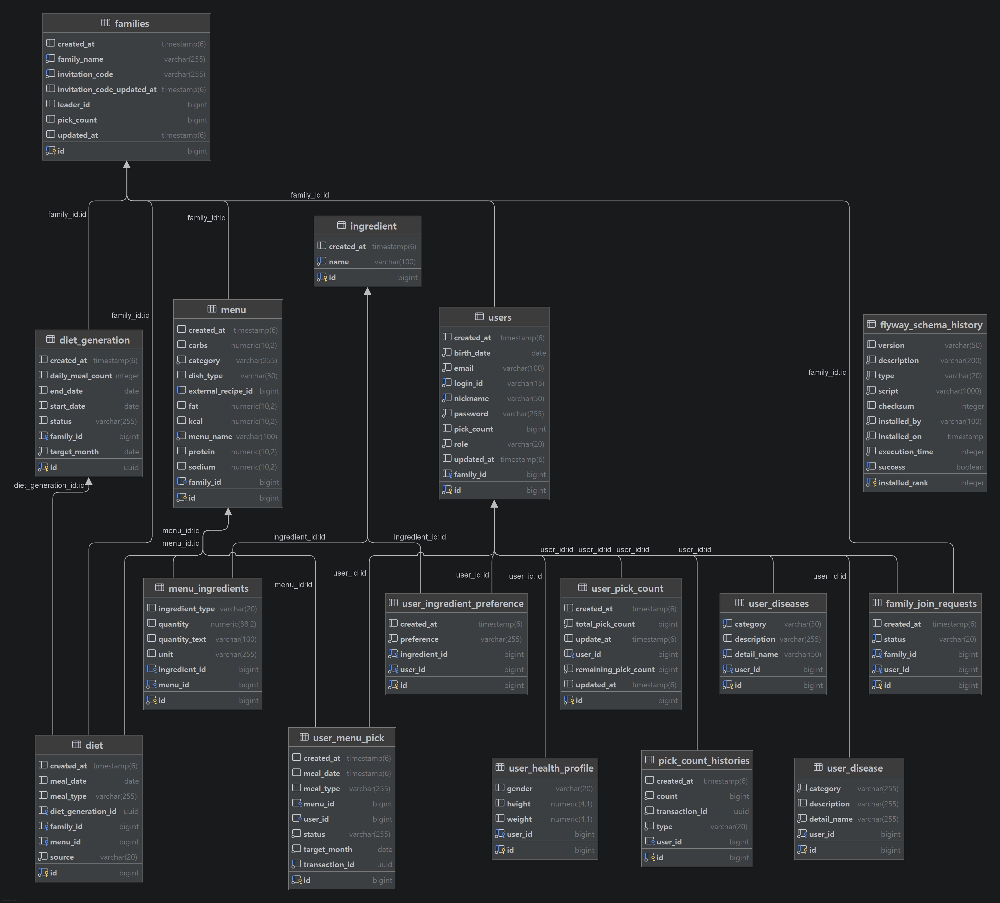

# pick-meal - AI식단 백엔드 프로젝트

### PickMeal은 가족 구성원의 음식 선호도와 알레르기 정보를 반영하여 월 단위 식단을 생성하고 함께 관리할 수 있는 가족 단위 식단 관리 서비스입니다.
## 1. 프로젝트 개요

- 식품안전처 및 농식품 공공 API를 활용한 메뉴·재료·영양 정보 수집
- 가족 생성, 초대 코드 가입, 가입 승인 및 가족 구성원 관리
- 가족 리더와 일반 구성원을 구분한 권한 기반 기능 제공
- 가족 구성원의 선호 음식 및 알레르기 재료 관리
- 구성원이 원하는 메뉴를 사전에 선택하여 식단 생성에 반영
- AI를 활용한 월 단위 식단 비동기 생성
- 생성된 식단의 월별·일별 조회 및 관리
- 카테고리, 요리 종류, 메뉴명, 영양 정보를 기반으로 한 메뉴 조회
- 동일한 요리 종류의 대체 메뉴 검색 및 추천
- 알레르기 재료를 제외한 대체 메뉴 추천과 확정 식단 메뉴 교체
- 가족이 직접 등록한 커스텀 메뉴 생성·조회·수정·삭제
- JWT와 Redis를 활용한 인증 및 토큰 관리
- 현재 Spring Boot 기반 REST API를 구현했으며 React 프론트엔드 연동 예정

## 2. 기술 스택

| 구분           | 기술                       |
|--------------|--------------------------|
| Backend      | Spring Boot              |
| Database     | PostgreSQL               |
| Cache/Auth   | Redis, JWT               |
| Test         | JUnit5, Mockito, MockMvc |
| Infra        | Docker, GitHub Actions   |
| External API | 공공데이터 레시피 API            |

## 3. 주요 기능

### 회원 / 인증

- JWT 기반 로그인
- Refresh Token Redis 저장
- 로그아웃 시 Access Token blacklist 처리

## 주요 API 핵심 서비스 흐름

1. 사용자가 회원가입 및 로그인을 진행한다.
2. 사용자는 가족 그룹을 생성하거나 초대 코드를 통해 기존 가족에 가입을 신청한다.
3. 가족 리더는 가입 신청을 승인하거나 거절하고, 가족 구성원을 관리한다.
4. 가족 구성원은 선호·비선호·알레르기 재료 정보를 등록한다.
5. 서비스는 외부 공공 API에서 수집한 메뉴·재료·영양 정보를 데이터베이스에 저장하고 메뉴 조회에 활용한다.
6. 사용자는 메뉴명, 카테고리, 요리 종류 등의 조건으로 메뉴를 검색하고 상세 정보를 확인한다.
7. 메뉴 상세 화면에서 칼로리, 탄수화물, 단백질, 지방, 나트륨 등의 영양 정보와 구성 재료를 확인한다.
8. 가족 구성원은 다음 식단에 포함되기를 원하는 메뉴를 사전에 선택한다.
9. 가족 리더는 대상 월과 일일 식사 횟수를 지정하여 AI 식단 생성을 요청한다.
10. 서비스는 가족 구성원의 메뉴 선택 및 알레르기 정보를 반영하여 월 단위 식단을 비동기로 생성한다.
11. 사용자는 생성 상태를 확인하고, 생성이 완료된 식단을 월별·일별로 조회한다.
12. 가족 리더는 확정된 식단의 메뉴를 검색하거나 알레르기 재료가 제외된 추천 메뉴 중 하나로 교체할 수 있다.
13. 가족은 공공 데이터에 없는 메뉴를 커스텀 메뉴로 직접 등록하고 수정하거나 삭제할 수 있다.

상세 API 명세는 Notion 문서에 정리되어 있습니다.

## 4. 아키텍처 / 패키지 구조

```
src/main/java/kongju/pickmeal
├─ api
│  ├─ auth
│  ├─ diet
│  ├─ exception
│  ├─ family
│  ├─ menu
│  ├─ security
│  └─ user
│
├─ application
│  ├─ auth
│  ├─ diet
│  ├─ family
│  ├─ menu
│  └─ user
│
├─ common
│  ├─ ApiResponse
│  ├─ config
│  └─ exception
│
├─ core
│  ├─ ai
│  ├─ auth
│  ├─ common
│  ├─ diet
│  ├─ family
│  ├─ menu
│  ├─ service
│  └─ user
│
├─ infrastructure
│  ├─ config
│  ├─ external
│  ├─ repository
│  └─ service
│
└─ PickMealApplication
```

### 설계 의도

PickMeal은 기능별 도메인을 구분하면서도 각 계층의 책임이 섞이지 않도록  
`api`, `application`, `core`, `infrastructure`, `common` 계층으로 구성했습니다.

- `api`
  - Controller, 인증·인가 처리, 전역 예외 처리 코드를 배치합니다.
  - HTTP 요청을 받아 application 계층에 전달하고, 처리 결과를 공통 응답 형식으로 반환합니다.
  - 비즈니스 로직은 직접 처리하지 않고 application 계층에 위임합니다.

- `application`
  - 회원, 가족, 메뉴, 식단 관련 유스케이스와 요청·응답 DTO를 관리합니다.
  - Controller로부터 전달받은 요청을 처리하고, 응답 DTO로 변환합니다.
  - 여러 도메인과 repository를 조합하며 트랜잭션 경계를 관리합니다.

- `core`
  - 엔티티, 열거형, 도메인 규칙과 repository interface를 정의합니다.
  - 데이터베이스나 외부 API의 세부 구현에 의존하지 않는 핵심 비즈니스 로직을 관리합니다.
  - AI 식단 생성 기능도 interface로 추상화하여 특정 AI 구현체와 분리했습니다.

- `infrastructure`
  - Spring Data JPA, Redis, 공공데이터 API 및 AI API 연동을 구현합니다.
  - core 계층에 정의된 repository와 외부 서비스 interface의 실제 구현체를 제공합니다.
  - 외부 데이터를 조회하고 내부 도메인 모델로 변환하는 역할을 담당합니다.

- `common`
  - 공통 API 응답 형식, 예외 처리, 오류 코드와 공통 설정을 관리합니다.

repository는 `core` 계층에 interface로 정의하고, `infrastructure` 계층에서  
Spring Data JPA 기반 adapter로 구현했습니다. 이를 통해 application 계층이  
Spring Data JPA 구현체에 직접 의존하지 않고 도메인 관점의 interface를 통해 데이터에 접근하도록 구성했습니다.

공공데이터와 AI 연동 역시 interface와 구현체를 분리하여 외부 서비스가 변경되더라도  
application 및 core 계층의 변경을 최소화할 수 있도록 설계했습니다.

## 5. ERD / 핵심 도메인 구조



### 핵심 도메인

- `User`: 서비스 사용자이며, 소속 가족과 가족 내 역할 정보를 관리
- `Family`: 가족 그룹과 초대 코드 등의 가족 관리 정보
- `FamilyJoinRequest`: 초대 코드를 통한 가족 가입 신청과 처리 상태
- `UserIngredientPreference`: 사용자의 선호·비선호·알레르기 재료 정보

- `Menu`: 공공 API 또는 가족이 직접 등록한 메뉴 정보
- `Ingredient`: 메뉴 구성에 사용되는 재료 마스터 정보
- `MenuIngredient`: 메뉴와 재료의 연결 정보 및 사용량·단위·재료 구분 정보

- `DietGeneration`: 월 단위 식단 생성 요청과 비동기 처리 상태 관리
- `Diet`: 특정 날짜와 식사 구분에 배정된 확정 메뉴 정보
- `UserMenuPick`: 가족 구성원이 특정 월의 식단에 반영하기 위해 사전에 선택한 메뉴 정보

### 주요 관계

- 하나의 가족에는 여러 사용자가 소속될 수 있으며, 사용자는 최대 하나의 가족에 소속됩니다.
- 사용자는 가족 내에서 `LEADER` 또는 `MEMBER` 역할을 가집니다.
- 가족 생성자는 리더가 되며, 가족 리더는 가입 신청 승인·거절, 구성원 방출, 가족 해체 등의 관리 권한을 가집니다.
- 가족 가입 신청은 신청 사용자와 대상 가족을 연결하며, 처리 상태를 관리합니다.

- 사용자는 건강 프로필과 질병 정보를 등록할 수 있습니다.
- 사용자는 여러 재료에 대해 선호, 비선호, 알레르기 정보를 등록할 수 있습니다.
- `UserIngredientPreference`는 사용자와 재료를 연결하고 해당 재료에 대한 선호 유형을 관리합니다.

- 하나의 메뉴는 여러 재료로 구성되며, 하나의 재료는 여러 메뉴에 사용될 수 있습니다.
- `MenuIngredient`는 메뉴와 재료를 연결하고 사용량, 단위, 주재료·부재료 구분 등의 정보를 관리합니다.
- 메뉴는 외부 공공 API를 통해 수집하거나 가족이 직접 커스텀 메뉴로 등록할 수 있습니다.
- 가족 커스텀 메뉴는 해당 가족 구성원만 조회·수정·삭제할 수 있습니다.

- 가족 구성원은 특정 대상 월에 식단에 포함되기를 원하는 메뉴를 사전에 선택할 수 있습니다.
- `UserMenuPick`은 사용자, 메뉴, 대상 월을 연결하고 식단 생성 반영 여부를 상태로 관리합니다.

- 하나의 가족은 여러 식단 생성 요청을 가질 수 있습니다.
- `DietGeneration`은 가족, 대상 월, 생성 기간, 일일 식사 횟수와 비동기 생성 상태를 관리합니다.
- 하나의 식단 생성 요청을 통해 날짜와 식사 구분별 여러 `Diet` 데이터가 생성됩니다.
- `Diet`은 가족, 식단 생성 요청, 메뉴를 연결하며 특정 날짜와 식사 구분의 확정 메뉴 한 건을 나타냅니다.
- 식단 메뉴에는 AI 추천, 사용자 사전 선택, 수동 교체 등의 선정 출처가 기록됩니다.
- 사용자가 사전에 선택한 메뉴로 확정된 식단은 임의로 교체할 수 없습니다.
- 확정 식단의 메뉴는 같은 요리 종류의 메뉴로 교체할 수 있으며, 가족의 알레르기 재료가 포함된 메뉴는 추천 후보에서 제외됩니다.

상세 테이블 구조와 컬럼 설명은 Notion 문서에 정리했습니다.

## 6. 대표 API

| 기능 | Method | Endpoint | 설명 |
|---|---|---|---|
| 회원가입 | POST | `/api/v1/users/signup` | 사용자 계정 생성 |
| 로그인 | POST | `/api/v1/auth/login` | Access Token 및 Refresh Token 발급 |
| 가족 생성 | POST | `/api/v1/families` | 가족 그룹 생성 |
| 가족 합류 신청 | POST | `/api/v1/families/applications` | 초대 코드를 이용한 가족 합류 신청 |
| 가족 합류 승인·거절 | PATCH | `/api/v1/families/me/applications/{requestId}` | 가족 리더가 가입 신청 처리 |
| 질병 정보 수정 | PATCH | `/api/v1/users/me/diseases` | 사용자 질병 정보 수정 |
| 재료 선호 정보 수정 | PATCH | `/api/v1/users/me/ingredient-preferences` | 선호·비선호·알레르기 재료 정보 수정 |
| 메뉴 필터 옵션 조회 | GET | `/api/v1/menus/filter-options` | 카테고리 및 요리 종류 목록 조회 |
| 메뉴 목록 조회 | GET | `/api/v1/menus?category=KOREAN&dishType=STEW&page=0&size=20` | 조건에 따른 메뉴 페이징 조회 |
| 메뉴 상세 조회 | GET | `/api/v1/menus/{menuId}` | 메뉴 영양 정보 및 구성 재료 조회 |
| 커스텀 메뉴 등록 | POST | `/api/v1/menus/custom` | 가족 전용 커스텀 메뉴 등록 |
| 커스텀 메뉴 수정 | PUT | `/api/v1/menus/custom/{menuId}` | 가족 커스텀 메뉴 전체 수정 |
| 커스텀 메뉴 삭제 | DELETE | `/api/v1/menus/custom/{menuId}` | 가족 커스텀 메뉴 삭제 |
| 대체 메뉴 검색 | GET | `/api/v1/diets/{dietId}/replacement-menus` | 현재 식단과 같은 요리 종류의 대체 메뉴 검색 |
| 대체 메뉴 추천 | GET | `/api/v1/diets/{dietId}/replacement-menu-suggestions` | 가족 알레르기 재료를 제외한 대체 메뉴 추천 |
| 확정 식단 메뉴 교체 | PUT | `/api/v1/diets/{dietId}/menu` | 확정 식단 메뉴를 선택한 메뉴로 교체 |
## 7. 실행 방법

### 1. 프로젝트 클론

```bash
git clone https://github.com/사용자명/pickmeal.git
cd pickmeal
```

### 2. 환경 변수 설정

애플리케이션 실행 전 다음 환경 변수를 설정해야 합니다.

```env
# PostgreSQL
DB_URL=jdbc:postgresql://localhost:5432/pickmeal
DB_USERNAME=your_username
DB_PASSWORD=your_password

# Redis
REDIS_HOST=localhost
REDIS_PORT=6379

# JWT
JWT_ACCESS_SECRET=your_access_token_secret_at_least_32_bytes
JWT_REFRESH_SECRET=your_refresh_token_secret_at_least_32_bytes

# OpenAI
OPENAI_API_KEY=your_openai_api_key

# 공공데이터 API
PUBLIC_DATA_API_KEY=your_public_data_api_key
FOOD_SAFETY_API_KEY=your_food_safety_api_key
```

### 3. PostgreSQL / Redis 실행

Docker Compose를 사용하는 경우:

```
docker compose up -d
```

### 4. 애플리케이션 실행

```
bash gradlew bootRun --args='--spring.profiles.active=local'
```

### 5. 테스트 실행

```
bash gradlew test
```

## 외부 API 데이터 Import

Linux/macOS에서 .env를 현재 셸 환경변수로 등록한다.
```
set -a
source .env
set +a
```

공공데이터 기반 메뉴/재료 데이터 적재:

```
bash gradlew bootRun --args='--spring.profiles.active=local,public-data-import'
```


```
bash gradlew bootRun --args='--spring.profiles.active=local,food-safety-import'
```

## 8. 테스트 방법

### 테스트 실행

```bash
bash gradlew test
```

| 도구                   | 사용 목적                        |
|----------------------|------------------------------|
| JUnit5               | 테스트 코드 작성 및 실행               |
| Mockito              | Service 테스트에서 의존 객체 Mock 처리  |
| MockMvc              | Controller 계층의 HTTP 요청/응답 검증 |
| Spring Security Test | 인증/인가가 필요한 API 테스트           |

### 테스트 범위

- 인증 API
  - 회원가입
  - 로그인 및 로그아웃
  - Access Token 재발급
  
- 가족 관리 API
  - 가족 생성
  - 초대 코드를 통한 가족 합류 신청
  - 합류 신청 승인 및 거절
  - 가족 구성원과 가입 신청 목록 조회
  - 초대 코드 재발급
  - 가족 구성원 방출
  - 가족 탈퇴 및 가족 해체
  - 가족 리더와 일반 구성원의 권한 검증
  
- 사용자 정보 API
  - 건강 및 질병 정보 수정
  - 선호·비선호·알레르기 재료 정보 수정
  - 요청값 유효성 검증

- 메뉴 API
  - 메뉴 필터 옵션 조회
  - 메뉴명·카테고리·요리 종류 기반 목록 검색
  - 메뉴 목록 페이징 응답 검증
  - 메뉴 상세 및 영양·재료 정보 조회
  - 가족 커스텀 메뉴 등록·수정·삭제
  - 다른 가족의 커스텀 메뉴 접근 제한
  - 삭제된 메뉴 조회 및 수정 제한

- 사용자 메뉴 선택 API
  - 식단에 반영할 메뉴 사전 선택
  - 대상 월별 선택 메뉴 조회
  - 선택 가능 개수 제한
  - 선택 메뉴 취소
  - 식단 생성에 사용된 메뉴 선택 상태 변경

- 식단 생성 API
  - 대상 월과 일일 식사 횟수를 이용한 식단 생성 요청
  - 중복 생성 요청 제한
  - 식단 생성 기간 계산
  - 비동기 생성 요청 및 상태 변경
  - 생성 성공·실패 상태 처리
  - 사용자 선택 메뉴와 가족 알레르기 정보 반영
  - AI 응답 검증 및 식단 저장

- 식단 조회 API
  - 월별 식단 조회
  - 날짜 및 식사 구분별 식단 조회
  - 다른 가족 식단 접근 제한
  - 식단 생성 상태 조회

- 확정 식단 메뉴 교체 API
  - 현재 메뉴와 동일한 요리 종류의 대체 메뉴 검색
  - 대체 메뉴 목록 페이징 및 키워드 검색
  - 가족 알레르기 재료가 포함된 메뉴 제외
  - 알레르기 재료를 제외한 대체 메뉴 랜덤 추천
  - 추천 메뉴의 영양 및 재료 정보 조회
  - 선택한 메뉴로 확정 식단 교체
  - 사용자가 사전에 선택한 메뉴의 교체 제한
  - 가족 리더 권한 및 메뉴 교체 조건 검증

Controller 테스트에서는 `MockMvc`를 사용하여 HTTP 상태 코드, 요청값 검증, 권한 처리 및 JSON 응답 구조를 확인했습니다.  
인증이 필요한 API는 `@WithMockUser` 또는 Spring Security Test의 `user()` 요청 후처리기를 사용해 사용자 역할별 접근 권한을 검증했습니다.

Service 테스트에서는 JUnit과 Mockito를 사용하여 repository 및 외부 연동 객체를 격리하고, 유스케이스별 성공·실패 흐름과 도메인 규칙을 검증했습니다. 공공데이터 및 AI API 호출은 실제 외부 요청 대신 mock 객체를 사용했습니다.

## 9. 핵심 기술적 고민 3~5개 핵심 설계 및 트러블슈팅

### 1. Menu와 Diet 도메인 분리

초기에는 메뉴 관련 모델을 `diet` 패키지에 함께 두었지만, `Menu`는 사용자가 실제로 선택한 식단 기록이 아니라 식단 선택을 위한 후보 데이터에 가깝다고 판단했습니다.

따라서 `Menu`, `Ingredient`, `MenuIngredient`는 `menu` 도메인으로 분리하고, `Diet`는 사용자가 실제로 선택하거나 확정한 식단 기록을 담당하도록 분리했습니다.

이를 통해 메뉴 데이터 조회/필터링과 식단 선택/확정 로직의 책임을 분리했습니다.

### 2. Repository Port-Adapter 분리

초기에는 application 계층에서 Spring Data JPA Repository를 직접 의존했습니다.  
이 경우 도메인/유스케이스 로직이 JPA 구현체에 강하게 결합된다고 판단했습니다.

이를 개선하기 위해 `core` 계층에는 repository interface를 정의하고, `infrastructure` 계층에서 JPA adapter가 이를 구현하도록 분리했습니다.

이를 통해 application 계층은 JPA 구현체가 아니라 repository port에만 의존하도록 구성했습니다.

### 3. 외부 API 기반 메뉴 데이터 Import

메뉴와 재료 데이터는 직접 입력하지 않고, 공공 레시피 API와 식품안전나라 API를 기반으로 수집했습니다.

각 API는 응답 구조와 제공 데이터가 달라 import service와 client를 분리했습니다.  
또한 import 작업은 일반 애플리케이션 실행과 분리하기 위해 `public-data-import`, `food-safety-import` profile 기반 runner로 실행되도록 구성했습니다.

이를 통해 일반 서버 실행과 데이터 적재 작업이 동시에 수행되지 않도록 분리했습니다.

### 4. 비정형 재료 문자열 파싱

외부 API의 재료 정보는 구조화된 JSON이 아니라 `"된장 5g, 두부 20g"`과 같은 문자열 형태로 제공되었습니다.

이를 메뉴와 재료 테이블로 정규화하기 위해 재료 문자열을 줄바꿈, 쉼표, 수량 시작 위치 기준으로 파싱하는 parser를 구현했습니다.

수량 단위가 일정하지 않은 데이터가 많았기 때문에 `quantity`와 `unit`을 무리하게 분리하지 않고, 원문 수량을 `quantityText`로 보존했습니다.

### 5. 가족 리더 권한 처리

가족 가입 승인, 구성원 방출, 초대 코드 재발급, 가족 해체와 같은 기능은 가족 리더만 수행할 수 있도록 제한했습니다.

컨트롤러에서는 인증 사용자를 기준으로 요청을 받고, 서비스 계층에서 해당 사용자가 대상 가족의 리더인지 검증했습니다.

이를 통해 다른 가족의 데이터에 접근하거나, 권한 없는 사용자가 가족 관리 기능을 수행하지 못하도록 처리했습니다.

### 6. AI 식단 생성의 비동기 처리와 상태 관리

월 단위 식단 생성은 AI 응답 대기와 결과 검증, 여러 식단 데이터 저장이 포함되어 일반 API 요청보다 처리 시간이 길어질 수 있습니다.

처음에는 식단 생성 요청 안에서 AI 호출부터 데이터 저장까지 모두 처리하는 방식을 고려했지만, 요청 시간이 길어지고 처리 결과를 사용자에게 즉시 반환하기 어렵다는 문제가 있었습니다.

이를 해결하기 위해 식단 생성 요청 자체를 나타내는 `DietGeneration`을 별도 도메인으로 구성하고, 생성 요청과 실제 AI 처리 작업을 분리했습니다.

- 식단 생성 요청 시 `PENDING` 상태의 `DietGeneration` 저장
- 생성 요청 ID와 현재 상태를 즉시 응답
- `@Async`를 이용하여 AI 식단 생성 작업을 별도 스레드에서 수행
- 처리 과정에 따라 `PROCESSING`, `COMPLETED`, `FAILED` 상태로 변경
- 사용자는 생성 ID를 통해 처리 상태를 별도로 조회

이를 통해 긴 AI 처리 시간 동안 HTTP 요청을 유지하지 않고, 생성 진행 상태와 실패 여부를 명확하게 관리할 수 있도록 구성했습니다.

### 7. 비동기 작업과 트랜잭션 커밋 시점 분리

식단 생성 요청을 저장한 직후 비동기 메서드를 호출할 경우, 기존 트랜잭션이 아직 커밋되지 않아 비동기 스레드에서 생성 요청 데이터를 조회하지 못할 가능성이 있었습니다.

비동기 메서드는 호출한 스레드와 별도의 트랜잭션에서 동작하므로, 단순히 repository의 `save()`가 호출되었다고 해서 다른 스레드에서 해당 데이터가 즉시 보장되는 것은 아니었습니다.

이에 따라 식단 생성 요청 저장 트랜잭션이 정상적으로 커밋된 이후 비동기 작업을 실행하도록 책임을 분리했습니다.

또한 AI 호출, 응답 검증, 식단 저장, 상태 변경을 각각 구분하여 실패 발생 시 `DietGeneration`의 상태를 `FAILED`로 변경하고 실패 원인을 추적할 수 있도록 구성했습니다.

이를 통해 비동기 처리 과정에서 발생할 수 있는 조회 시점 문제와 불완전한 상태 저장을 방지했습니다.

### 8. JWT Access/Refresh Token과 Redis 기반 인증 상태 관리

초기에는 JWT 자체의 만료 시간만으로 인증을 관리하는 방식을 고려했지만, 발급된 토큰을 서버에서 즉시 무효화하기 어렵다는 문제가 있었습니다.

이를 해결하기 위해 Access Token과 Refresh Token을 분리하고, Refresh Token은 Redis에 저장하도록 구성했습니다.

- Access Token은 짧은 만료 시간을 사용하여 API 인증에 활용
- Refresh Token은 Redis에 저장하고 재발급 요청 시 서버 데이터와 비교
- 로그아웃 시 Redis의 Refresh Token 제거
- 로그아웃된 Access Token은 남은 만료 시간 동안 Redis 블랙리스트에 등록
- Access Token과 Refresh Token에 서로 다른 Secret과 만료 시간 사용

이를 통해 단순한 Stateless JWT 방식의 한계를 보완하고, 로그아웃과 토큰 재발급 상태를 서버에서 통제할 수 있도록 구성했습니다.

### 9. 확정 식단 메뉴 교체 규칙과 알레르기 메뉴 제외

확정된 식단의 메뉴를 아무 메뉴로나 교체할 수 있게 하면 식사의 종류가 달라지거나 가족 구성원의 알레르기 정보가 무시될 수 있습니다.

이에 따라 메뉴 교체 시 다음 조건을 검증하도록 구성했습니다.

- 요청 사용자가 해당 가족의 리더인지 확인
- 현재 식단과 같은 요리 종류의 메뉴만 교체 허용
- 사용자가 식단 생성 전에 직접 선택한 메뉴는 교체 제한
- 현재 메뉴와 동일한 메뉴는 후보에서 제외
- 가족 구성원의 알레르기 재료가 포함된 메뉴는 추천 후보에서 제외

알레르기 메뉴 제외는 메뉴 후보를 조회한 뒤 애플리케이션에서 반복적으로 검사하는 대신, `MenuIngredient` 연결 관계를 이용한 `NOT EXISTS` 서브쿼리로 처리했습니다.

```sql
not exists (
    select 1
    from MenuIngredient mi
    where mi.menu = m
      and mi.ingredient.id in :allergyIngredientIds
)

## 10. Notion 상세 문서 링크

https://app.notion.com/p/33cc5ec7e63d80ca8f9ef6a42faaf6dd?source=copy_link
